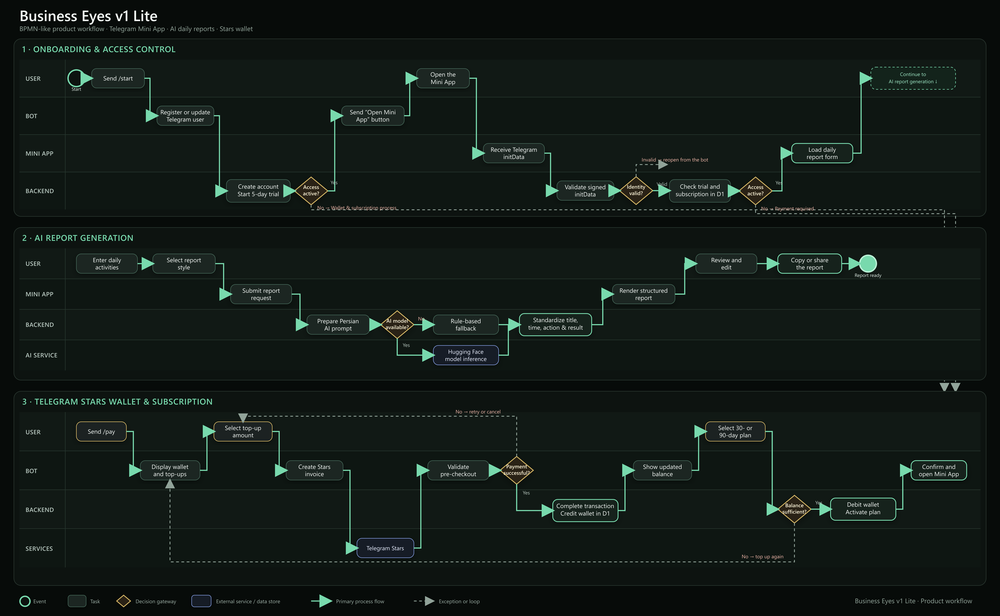

# Business Eyes v1 Lite

> An AI-powered Telegram Mini App that turns informal Persian daily activities into concise, structured, manager-ready work reports.

[](https://core.telegram.org/bots/webapps)
[](https://www.cloudflare.com/)
[](https://huggingface.co/)
[](#project-status)

**Live Mini App:** [Business Eyes v1 Lite](https://rooznegar-daily-report.zahrawi-biz.chatgpt.site/)

## Why I built Business Eyes

A few years ago, my journey into structured task management began with [ClickUp](https://clickup.com/).

At the time, I was constantly looking for ways to make my reports more useful for senior management—not simply a list of completed tasks, but a clear source of insight for better decision-making.

With the help of AI, I started improving my reports by including:

- Weekly performance analysis
- Forecasts for the upcoming week
- Clear visual hierarchy and highlighted insights
- Structured and measurable task descriptions
- Radar charts for faster performance analysis

This approach helped me communicate my work more effectively, earn greater trust within the organization, and eventually take responsibility for onboarding team members, designing task-management workflows, and analyzing team performance.

Over time, this became one of my core professional skills.

I later implemented and customized task-management systems for different teams and projects, helping businesses move from traditional workflows toward more structured, measurable, and efficient operations.

However, I repeatedly encountered the same challenges:

- Team members completed only the general task-description field.
- Time spent on activities was not recorded accurately.
- Task titles were inconsistent or unclear.
- Important activities were often forgotten.
- Reports lacked the structure managers needed for analysis.

I began teaching team members how to use prompt engineering to turn their daily activities into clear and professional reports. But one question stayed with me:

> What if people could create high-quality reports without having to learn prompt engineering?

That question became the starting point for **Business Eyes**.

**Business Eyes v1 Lite** allows users to describe their daily activities naturally—in Persian—and automatically transforms them into concise, structured, and manager-ready work reports.

This is only the first step. I am passionate about helping businesses transition from traditional processes to modern, intelligent, and measurable systems. Business Eyes is the beginning of that journey as a product.

Being recognized as a **Verified ClickUp Power User**, ranked among the top 10% of ClickUp users globally by platform usage, makes this milestone even more meaningful to me. Thank you, ClickUp, for being an important part of this journey.

Feedback, experiences, and ideas are welcome as I continue developing future versions of Business Eyes.

## The problem

Daily reports are often incomplete, inconsistent, and difficult for managers to evaluate. Employees may forget activities, omit the time spent, use unclear titles, or write long descriptions that do not communicate outcomes.

Business Eyes reduces that friction by letting users write naturally while the system applies a consistent reporting framework.

## What the product does

1. The user opens the Telegram bot and receives a five-day free trial.
2. The bot validates access and opens the Telegram Mini App.
3. The user writes daily activities in natural Persian.
4. The user selects a report style: formal, concise, or result-oriented.
5. The backend validates Telegram identity and subscription access.
6. A Hugging Face model converts the input into a structured report.
7. If the AI service is unavailable, a deterministic fallback creates a preview report.
8. The user reviews, edits, copies, or shares the final report.
9. After the trial expires, wallet top-up and subscription activation are completed through the Telegram bot using Telegram Stars.

## Product workflow



The editable workflow sources are available in [`docs/architecture`](docs/architecture/README.md).

## Main features

- Persian-first daily activity input
- Formal, concise, and result-oriented report styles
- Manager-ready output with task title and recorded duration
- Secure Telegram Mini App authentication using signed `initData`
- Five-day automatic free trial
- 30-day and 90-day subscription plans
- Internal wallet funded through Telegram Stars
- Preset and custom wallet top-up amounts
- Atomic wallet transactions and subscription activation
- Dynamic Telegram name and profile image in the interface
- Hugging Face model integration
- Rule-based preview and fallback mode
- Cloudflare D1 persistence
- Serverless deployment architecture

## Architecture

```text
Telegram User
   │
   ├── Telegram Bot
   │      ├── Registration and access status
   │      ├── Five-day trial
   │      ├── Wallet and Telegram Stars invoices
   │      └── Subscription activation
   │
   └── Telegram Mini App
          ├── Persian activity input
          ├── Report-style selection
          └── Copy and share output
                 │
                 ▼
        Serverless API Routes
          ├── Telegram initData validation
          ├── Access-control enforcement
          ├── Hugging Face inference
          └── Rule-based fallback
                 │
                 ▼
            Cloudflare D1
          ├── Telegram users
          ├── Wallet transactions
          └── Temporary bot sessions
```

## Technology stack

| Layer | Technology |
| --- | --- |
| User interface | React 19, Next.js 16, Tailwind CSS |
| Telegram integration | Telegram Bot API and Telegram Mini Apps |
| AI inference | Hugging Face Inference Router |
| Backend | Serverless route handlers on Cloudflare Workers |
| Database | Cloudflare D1 with Drizzle ORM |
| Runtime and build | Vinext, Vite, TypeScript |
| Payments | Telegram Stars (`XTR`) and internal wallet credits |

## Project structure

```text
business-eyes-v1-lite/
├── .github/
│   ├── dependabot.yml                # Weekly dependency update configuration
│   └── workflows/security.yml        # Audit, test, lint and build checks
├── app/
│   ├── api/
│   │   ├── generate/
│   │   │   └── route.ts              # Authentication, access check and AI report generation
│   │   └── telegram/
│   │       └── webhook/
│   │           └── route.ts          # Bot commands, Stars payments, wallet and subscriptions
│   ├── globals.css                   # Business Eyes visual design system
│   ├── layout.tsx                    # Application metadata and Telegram Web App script
│   └── page.tsx                      # Persian report-builder interface
├── components/
│   └── ui/                           # Reusable interface components
├── db/
│   ├── index.ts                      # Cloudflare D1 connection helpers
│   └── schema.ts                     # Users, bot sessions and wallet transaction models
├── docs/
│   └── architecture/
│       ├── README.md                 # Workflow documentation and usage
│       ├── business-eyes-workflow.mmd
│       ├── business-eyes-workflow.png
│       └── business-eyes-workflow.svg
├── drizzle/                          # Versioned D1 migrations
├── lib/
│   ├── telegram-api.ts               # Typed Telegram Bot API client
│   ├── telegram-auth.ts              # Telegram initData HMAC verification
│   └── utils.ts                      # Shared utilities
├── public/                            # Brand and static assets
├── scripts/                           # Portable build and deployment helpers
├── tests/
│   └── security.test.mjs             # Authentication and request-hardening tests
├── .env.example                       # Required runtime configuration
├── package.json
├── SECURITY.md                        # Production security and incident-response policy
└── README.md
```

## Getting started

### Prerequisites

- Node.js 22.13 or newer
- A Telegram bot created through BotFather
- A Cloudflare D1 database
- A Hugging Face access token for AI mode

### Installation

```bash
git clone <your-repository-url>
cd business-eyes-v1-lite
npm ci
```

Create your local environment file from `.env.example` and configure the values below:

```env
TELEGRAM_BOT_TOKEN=
TELEGRAM_WEBHOOK_SECRET=
APP_URL=https://your-app.example.com
MONTHLY_PRICE_CREDITS=
QUARTERLY_PRICE_CREDITS=
HF_TOKEN=
HF_MODEL=Qwen/Qwen2.5-7B-Instruct-1M:fastest
ALLOW_PREVIEW_MODE=false
MAX_REPORTS_PER_MINUTE=6
MAX_REPORTS_PER_DAY=100
HF_TIMEOUT_MS=25000
```

Never commit bot tokens, webhook secrets, or Hugging Face tokens.

### Development

```bash
npm run dev
```

### Quality checks

```bash
npm run lint
npm test
npm run build
```

### Database migrations

Generate a migration after changing `db/schema.ts`:

```bash
npm run db:generate
```

Apply the versioned SQL migrations to the configured D1 database before enabling the production webhook.

## Telegram bot commands

| Command | Purpose |
| --- | --- |
| `/start` | Register the user, display access status, and open the Mini App |
| `/pay` | Open wallet top-up and subscription options |
| `/balance` | Display wallet balance |
| `/status` | Display access and wallet status |
| `/paysupport` | Show payment-support guidance |
| `/terms` | Display wallet and subscription terms |

## Wallet and subscription rules

- The free trial lasts five days from the first Telegram interaction.
- Trial expiration is enforced whenever access is checked; no background scheduler is required.
- One successfully paid Telegram Star currently credits one internal wallet unit.
- Preset top-ups are 50, 100, 250, and 500 Stars.
- Custom top-ups accept between 10 and 2,500 Stars.
- Custom-amount input sessions expire after ten minutes.
- Subscription purchases debit the internal wallet atomically.
- A new subscription extends from the later of the current expiration date or the purchase time.
- Purchases are one-time and do not renew automatically.
- Plan prices are configured using `MONTHLY_PRICE_CREDITS` and `QUARTERLY_PRICE_CREDITS`.

## Security

See the complete [Security Policy and production checklist](SECURITY.md).

- Telegram Mini App `initData` is verified using HMAC-SHA256.
- Authentication payloads older than one hour are rejected.
- Telegram webhook requests require a secret-token header.
- Webhook secrets must contain 32–256 allowed characters.
- Pre-checkout requests are matched against pending wallet transactions.
- Completed payments are processed idempotently.
- Secrets remain in runtime environment variables and are not stored in the repository.
- `.env`, `.env.local`, and `.dev.vars` secret files are excluded from Git.
- Production preview mode is disabled by default, so a missing bot token does not create a public unauthenticated API.
- JSON request bodies have strict content-type and size limits.
- Authenticated report generation is rate-limited per Telegram user and returns `429` when exceeded.
- Hugging Face requests have a bounded timeout to prevent resource exhaustion.
- Responses containing reports or authentication errors use `Cache-Control: no-store`.
- Security headers restrict framing to Telegram and disable unnecessary browser capabilities.
- AI output is instructed not to invent time, results, names, numbers, or missing details.

## Project status

This repository contains **Business Eyes v1 Lite**, the first product version. The current scope focuses on Persian daily-report generation, Telegram identity, access control, wallet top-up, and subscription activation.

Potential future versions may add team dashboards, manager analytics, recurring reporting, task-manager integrations, and performance visualizations.

## Acknowledgements

Business Eyes grew from years of practical experience designing task-management workflows and helping teams improve reporting quality. [ClickUp](https://clickup.com/) was an important part of that professional journey and the first task-management platform that inspired this direction.
